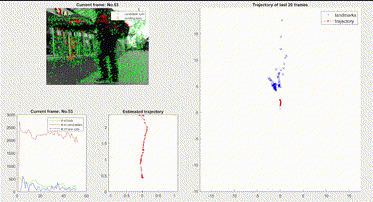
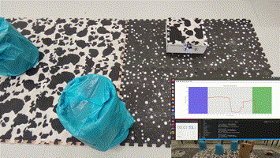
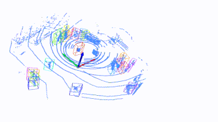
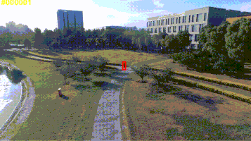

### 你好 | Good day | Bonjour | Guten Tag | 안녕  | こんにちは 👋

> *Study Robotics & ME. Coding Freshman. Robotics Apprentice.*

Hi, I'm **Yujie He** and simply go by Jay. I ...

- (am) learning to reinvent the customized research wheels.  [ 📈 **v4r-plot**](https://github.com/hibetterheyj/v4r-plot)  [🖥️ **YujieScripts**](https://github.com/hibetterheyj/YujieScripts) [:keyboard: **yujie_shell**](https://github.com/hibetterheyj/yujie_shell) [:film_strip: **rosbag_filter_gui**](https://github.com/hibetterheyj/rosbag_filter_gui)

- (enjoy) working on challenging but cool :robot: robotics and CV projects. 

  | [VIsual odometry](https://github.com/hibetterheyj/Visual-Odometry-Pipeline) | [Crazyflie autonomous navigation](https://github.com/hibetterheyj/Crazyflie_Auto_Navigation_Landing) |
  | ------------------------------------------------------------ | ------------------------------------------------------------ |
  |  |  |
  | [**Pedestrian trajectory analysis**](https://yujie-he.github.io/project/2021-qolo-pedestrian-analysis/) | [**Visual tracking for UAV**](https://yujie-he.github.io/project/2020-tracking4uav/) |
  |      |           |

- (have) contributed to fascinating **🏎 [DIANRacing](https://yujie-he.github.io/project/2018-dian-racing/)** and 🛠 **[Mechatronics Modules](https://yujie-he.github.io/project/2019-tongji-ta/)**

- 🎼 <u>listen classical & KPop music</u>

  Recommendation my bias: the recent cross-border performance by the Seoul Philharmonic Orchestra--[*Red Flavor (Orchestra Ver.)*](https://youtu.be/9tpWTRCQ6Hg)

- 🥾 <u>Hike</u> in the free time.

  🗺️ my [*Random Walk in Switzerland*](https://www.google.com/maps/d/u/0/embed?mid=1fKUxvCdWM73iL1d1a3rRhtZzR_KW_GYN&hl=en) map to record my footprint since Sep 2020

More about me on [Personal Website](https://yujie-he.github.io/)

------

⚡️ Powered by HE © 2020 - 2022
